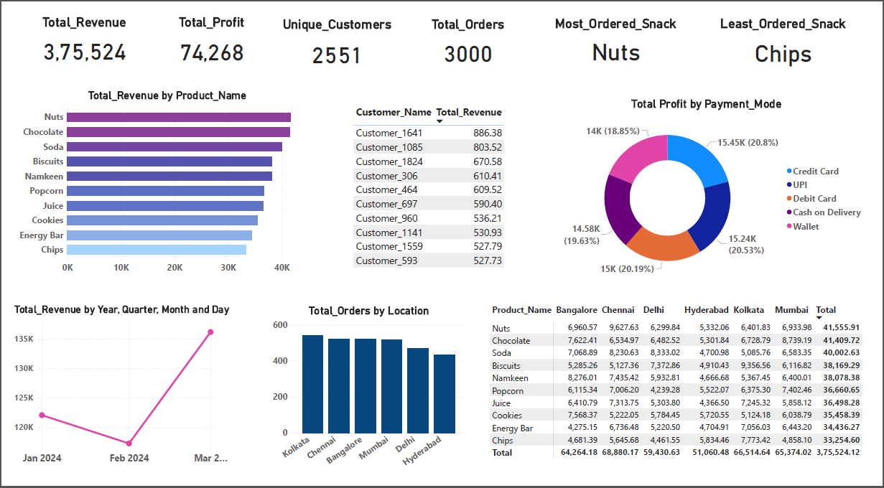

# 📊 Zepto Sales Dashboard – Data Analyst Portfolio Project

This is a portfolio project designed to simulate a real-time data analysis for a quick-commerce retail company **Zepto**. The aim of this project is to showcase data cleaning, transformation, and visualization using industry tools like Excel, SQL, and Power BI.

---

## 🛠️ Tools Used

- **Excel** – Data Cleaning & Pivot Table Summary  
- **Oracle SQL** – Data Transformation & KPI Extraction  
- **Power BI** – Dashboard Design & Visualization  

---

## 📈 Dashboard Preview

---

## 📌 Key Insights

- Total Orders, Revenue, and Profit KPIs  
- City-wise Sales Breakdown  
- Monthly Revenue Trend  
- Orders by Payment Mode  
- Top-Selling Products  
- Top 10 Customers by Total Spend  

---

## 📦 How to Use This Project

1. Review the `data/` folder for raw and summary Excel files  
2. Check `sql/` folder for Oracle-compatible SQL queries  
3. Open `.pbix` file in Power BI Desktop to explore visuals  
4. Use the `dashboard/` folder for static and PDF versions of the dashboard  

---

## 📧 Contact

**Mathiyarasi S** – Aspiring Data Analyst  
📩 mathisoundar2004@gmail.com  
🔗 [LinkedIn Profile](https://www.linkedin.com/in/mathiyarasi85/)

---
